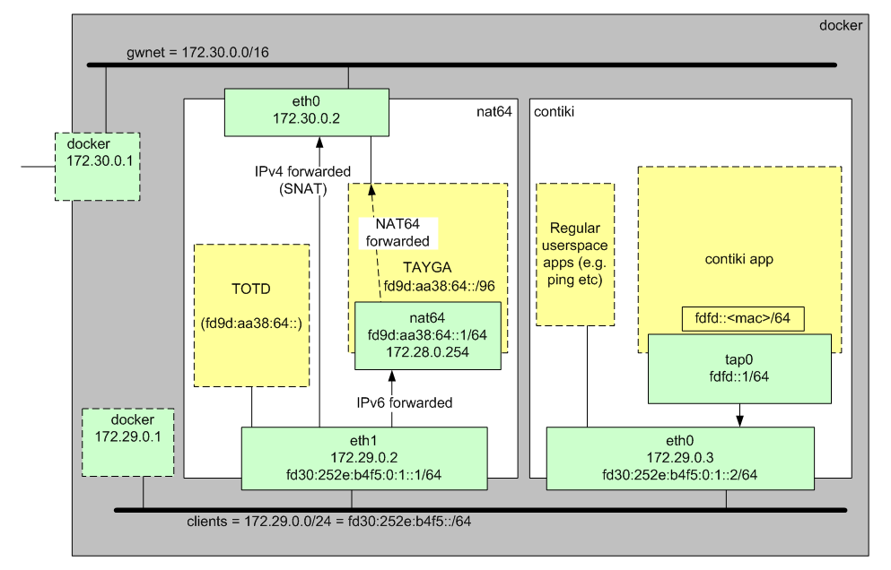

----

# Docker-NAT64

## Intro

This is a little docker container to run a IPv6 to IPv4 NAT ("NAT64") system.
It will be used for automated testing [Contiki](https://github.com/CreatorDev/contiki)
systems as part of the [Creator System Test Framework](https://github.com/CreatorDev/creator-system-test-framework).

## Notes

- The IPv6 prefix length set in Tayga config file is important, this is defined
  by [RFC6052](https://tools.ietf.org/html/rfc6052). TOTD is passing the IPv4
  address back in the low-order bytes of the IPv6 address, so you must ensure
  that Tayga is configured similarly (i.e. `/96`).

- The `creatordev/docker-nat64` is not being particularly smart with PID1, or
  restricting IP forwarding etc.  Similarly, it could be a whole bunch smaller.
  However, since this is only really meant for test systems, we're not too
  bothered at the moment.

- There's currently some hardcoding of routes from the nat64 container to the client
  container, although this should only affect clients using TAP devices. This can
  probably be resolved/removed through the use of router announcements, but there's
  a little work required to get that running.

## Credits

Thanks to the following projects:

- [Tayga](http://www.litech.org/tayga/)
- [TOTD](https://github.com/fwdillema/totd)

See also:

- Shawn Tan's [blog post](http://tech.sybreon.com/2015/05/05/nat64dns64-on-openwrt/)
  for achieving the same thing on OpenWRT.
- [unique-local-ipv6.com](http://unique-local-ipv6.com/) for generating
  your own local IPv6 addresses.